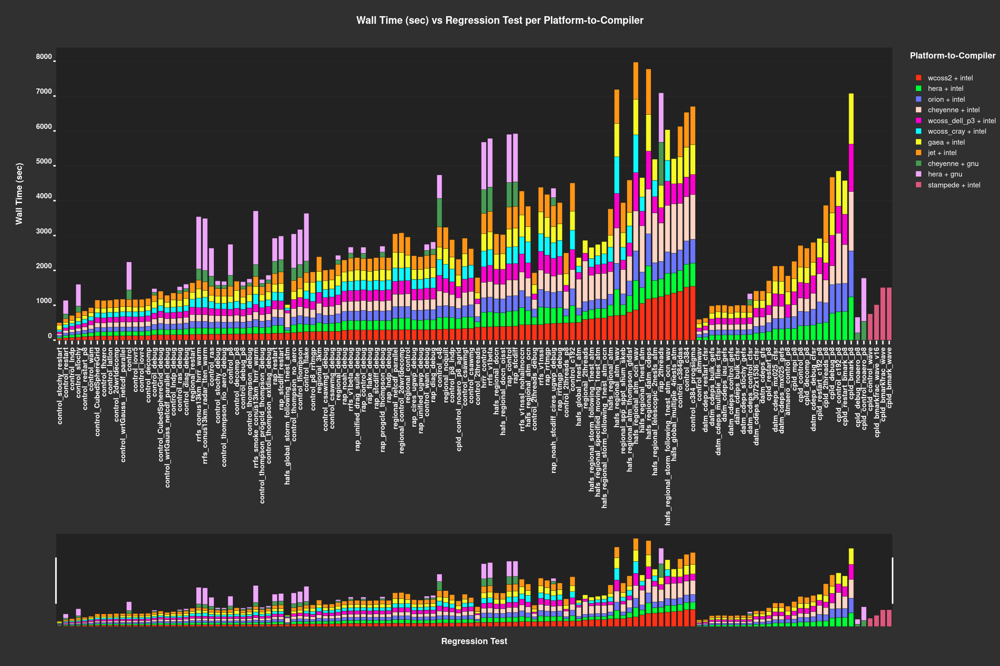
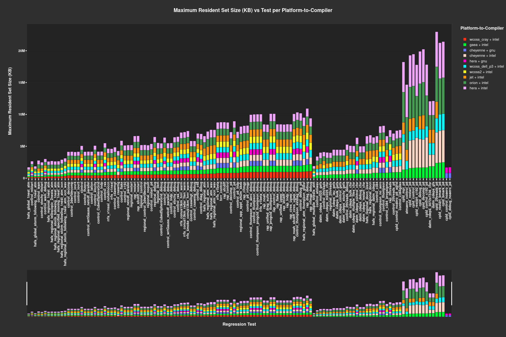
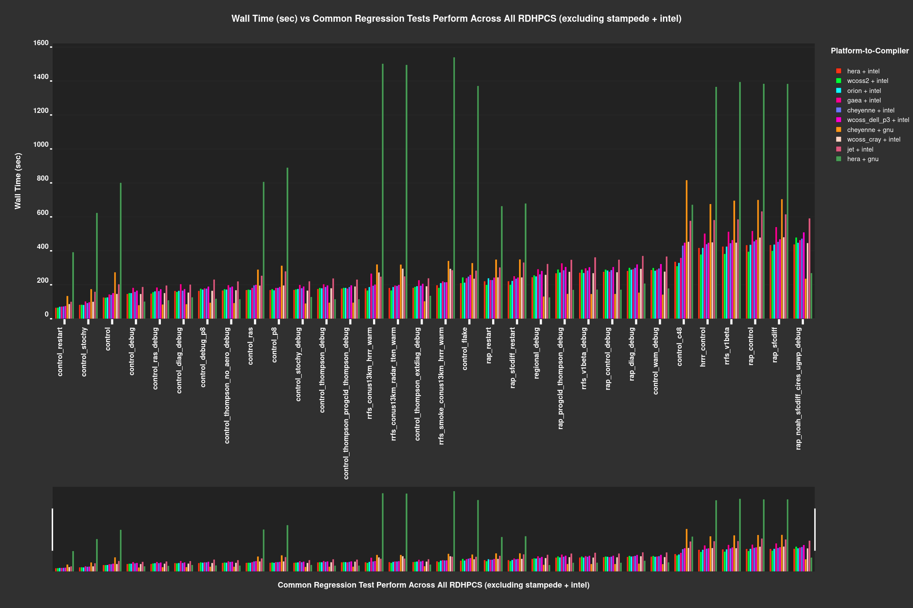

<h1 align="center">
UFS Weather Model Regression Test Log Extraction Application
</h1>

    
    
    

<h5 align="center">
    
[About](#About) • [Prerequisites](#Prerequisites) • [Quick Start](#Quick-Start) • [Environment Setup](#Environment-Setup) • [What's Included](#What's-Included) • [Status](#Status) • [Version](#Version) • [Documentation](#Documentation) 

</h5>

# About

__Introduction:__

Currently, the NOAA development teams' code managers, users & developers are analyzing the UFS-WM RT's log metrics for each regression test performed for each RDHPCS within individual text files via regularly opening these text files & reading the metrics to check if UFS-WM regression tests has passed/failed.
Note: This application is dependent on the current format of the UFS-WM log files (as of 02/2024), thus altering the internal format of the UFS-WM log files could affect the functionality of this application. 

__Purpose:__

The purpose of this script is to parse, extract, summarize, & display the metrics presented within the UFS-WM RT logs into plot figures -- while extracting the most recent revisions of the UFS-WM RT logs made to the UFS-WM developemnt branch. As developmeny continues, the application will be integrated with Jenkins to automate the conversion of the logs into visuals.

__Capabilities:__

This script will be able to perform the following actions:
* Extract content of the most recent revisions of the UFS-WM RT logs (For development purposes, the application will extract the logs from /NOAA-EPIC
/ufs-dev_logs repo/tests at this time -- which are the log files of  the UFS-WM RT repository's develop branch /tests/logs log files.)
* Parse, summarize, & display the metrics presented within the UFS-WM RT logs into plot figures
* Generates plot figures containing the metrics within the logs

__Future Capabilities:__

Could be integrated with another script, which will provide a user-friendly dashboard. Currently, the demo provides a prototype of a dashboard that features the log metrics. Further development on the dashboard is TBD. 

# Prerequisites
* 
* GitHub Personal Access Token
* Code managers of the UFS-WM test frameworks must ensure the following remains unchanged:
    * The current internal format of the UFS-RT logs must remain unchanged as of 02/2024. If the internal format is altered, then the current version of the UFS-WM RT Log Extraction Application's preprocessing module could be affected.
    * The existing nomenclature of the log files (e.g. RegressionTest_<PLATFORM_NAME>.log, OpnReqTest_<TEST_NAME>_<PLATFORM>.log) within the UFS-WM test frameworks must remain unchanged as of 02/2024. If the nomenclature of the log files are altered, then the current version of the UFS-WM RT Log Extraction Application's data loading & preprocessing module could be affected.
    * The current location of UFS-RT logs within the UFS-WM framework (https://github.com/ufs-community/ufs-weather-model/tree/develop/tests/logs) must remain unchanged as of 02/2024. If the log location is altered, then the current version of the UFS-WM RT Log Extraction Application's data loading module will be affected.

# Dataset
* UFS-WM Log files

# Quick Start
1) Setup your conda environment per the instructions shown under the __Environment Setup__ section.
2) Create your personal access token & set the credentials within the configuration file, __config.py__.
3) Initially, you will need to run the initial setup script, __setup.py__, to pull the UFS-WM repository. 
4) Run the main script, __main.py__, to extract, transform, load, & generate the plots featuring the fetched UFS-WM test log files.
5) After running __main.py__, the plots & dataframes featuring the fetched UFS-WM test log files will be generated & saved to a directory called /main/plotly_results & /main/dataframes, respectively.

# Environment Setup:

* Install miniconda on your machine. Note: Miniconda is a smaller version of Anaconda that only includes conda along with a small set of necessary and useful packages. With Miniconda, you can install only what you need, without all the extra packages that Anaconda comes packaged with:
Download latest Miniconda (e.g. 3.9 version):

    * wget https://repo.anaconda.com/miniconda/Miniconda3-py39_4.9.2-Linux-x86_64.sh

* Check integrity downloaded file with SHA-256:

    * sha256sum Miniconda3-py39_4.9.2-Linux-x86_64.sh

Reference SHA256 hash in following link: https://docs.conda.io/en/latest/miniconda.html

* Install Miniconda in Linux:

    * bash Miniconda3-py39_4.9.2-Linux-x86_64.sh

* Next, Miniconda installer will prompt where do you want to install Miniconda. Press ENTER to accept the default install location i.e. your $HOME directory. If you don't want to install in the default location, press CTRL+C to cancel the installation or mention an alternate installation directory. If you've chosen the default location, the installer will display “PREFIX=/var/home//miniconda3” and continue the installation.

* For installation to take into effect, run the following command:

source ~/.bashrc

* Next, you will see the prefix (base) in front of your terminal/shell prompt. Indicating the conda's base environment is activated.

* Once you have conda installed on your machine, perform the following to create a conda environment:

    * To create a new environment (if a YAML file is not provided)

        * conda create -n [Name of your conda environment you wish to create]

(OR)

    * To ensure you are running Python 3.9:

        * conda create -n myenv Python=3.9

(OR)

* To create a new environment from an existing YAML file (if a YAML file is provided):

    * conda env create -f environment.yml

*Note: A .yml file is a text file that contains a list of dependencies, which channels a list for installing dependencies for the given conda environment. For the code to utilize the dependencies, you will need to be in the directory where the environment.yml file lives.

### Activate the new environment via:

conda activate [Name of your conda environment you wish to activate]

* Verify that the new environment was installed correctly via:

    * conda info --env

*Note:

* From this point on, must activate conda environment prior to .py script(s) or jupyter notebooks execution using the following command: conda activate
    * To deactivate a conda environment:
        * conda deactivate

### Link Home Directory to Dataset Location on RDHPCS Platform

* Unfortunately, there is no way to navigate to the "/work/" filesystem from within the Jupyter interface when working on the remote server, Orion. The best way to workaround is to create a symbolic link in your home folder that will take you to the /work/ filesystem. Run the following command from a linux terminal on Orion to create the link:

    * ln -s /work /home/[Your user account name]/work

* Now, when you navigate to the /home/[Your user account name]/work directory in Jupyter, it will take you to the /work folder. Allowing you to obtain any data residing within the /work filesystem that you have permission to access from Jupyter. This same procedure will work for any filesystem available from the root directory.

*Note: On Orion, user must sym link from their home directory to the main directory containing the datasets of interest.

## Open & Run Application on Jupyter Notebook

* Open OnDemand has a built-in file explorer and file transfer application available directly from its dashboard via:

    * Login to https://orion-ood.hpc.msstate.edu/

* In the Open OnDemand Interface, select Interactive Apps > Jupyter Notbook

### Additonal Information

To create a .yml file, execute the following commands:

* Activate the environment to export:

    * conda activate myenv

* Export your active environment to a new file:

    * conda env export > [ENVIRONMENT FILENAME].yml

# What's Included
Within the download, you will find the following directories and files:
* Scripts:
    > __config.py__
    
    > __setup.py__
    
    > __main.py__
    
    > __load_data.py__
    
    > __generate_plots.py__
    
    > __init_setup.py__
* List of Dependencies: 
    > __log_tracker.yml__

# Status

# Version 1:
* Draft as of 06/17/22

# Version 2:
* Draft as of 02/07/24

